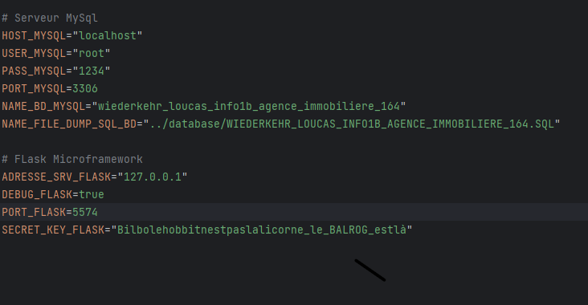

# Module 164 12.06.2023

Pour utiliser mon appliaction sur l'Agence Immoblilière, suivez les étapes ci-dessous :

1. Téléchargez et installez Python en version 3.10 ou 3.11 à partir du lien suivant : https://www.python.org/downloads/

2. Téléchargez et installez PyCharm version 2022.2.2 en vous rendant sur : https://www.jetbrains.com/pycharm/download/

3. Téléchargez Laragon depuis : https://laragon.org/download/index.html et procédez à son installation.

4. Téléchargez mon projet à partir de GitHub en téléchargeant le fichier .zip depuis ce lien : https://github.com/Louc4s/Wiederkehr_Loucas_INFO1B_Agence_Immobiliere

5. Lancez Laragon, cliquez sur "Start all", puis sur "Database". Si vous n'avez pas déjà une session, créez-en une en cliquant sur "Ajouter" et donnez-lui un nom de votre choix.

6. Décompressez le fichier .zip contenant le projet téléchargé.

7. Ouvrez PyCharm et importez le projet dans l'environnement.

8. Si nécéssaire, moddifer le mot de passe (PASS_MYSQL) ou le user (USER_MYSQL) dans le fichier .env selon votre configuration locale.

9. Exécutez le fichier "1_ImportationDumpSql.py" qui se trouve dans le répertoire "APP_AGENCE_164/database".

10. Exécutez le fichier "2_test_connection_bd.py" situé dans le répertoire "APP_AGENCE_164/database".

11. Lancez le fichier "run_mon_app.py".

12. Cliquez sur l'adresse IP affichée dans la console (http://127.0.0.1:5574).

Pour tout renseignements supplémentaires, prière de me contacter à cette adresse e-mail : loucas.wiederkehr@eduvaud.ch